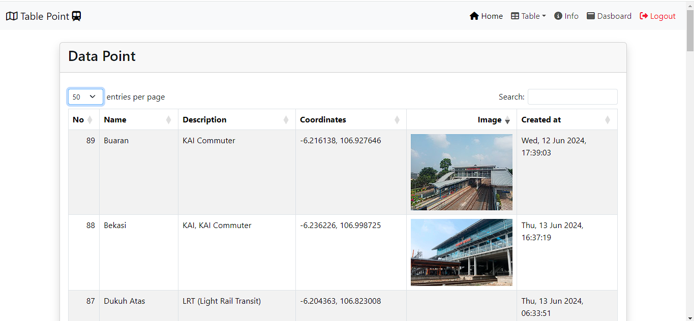

## Jakarta Metropolitan RailMap

Platform ini digunakan untuk menampilkan visualisasi peta Kereta Api KRL, LRT, dan MRT di Jakarta, serta menyediakan informasi terkini dan rute perjalanan.

## Komponen Pembangun

Platform ini dibangun menggunakan berbagai komponen, termasuk:
- Library LeafletJS
- Bootstrap
- FontAwesome
- File GeoJSON
- Terraformer

## Manfaat & Tujuan

- Menarik minat pengguna terhadap transportasi publik berbasis rel di Jakarta
- Menampilkan informasi rute dan stasiun kereta api secara online dan mudah diakses
- Mendukung city branding dan perencanaan transportasi di Jakarta

## Sumber Data

Sumber data untuk platform ini berasal dari berbagai dataset publik dan internal mengenai rute dan stasiun KRL, LRT, dan MRT di Jakarta.

## Visualisasi Peta Kereta Api

Platform ini menampilkan visualisasi peta untuk berbagai layanan kereta api di Jakarta, termasuk:
- KRL (Commuter Line)
- LRT (Light Rail Transit)
- MRT (Mass Rapid Transit)

Dengan menggunakan peta interaktif, pengguna dapat melihat rute, stasiun, dan informasi lainnya mengenai layanan kereta api di Jakarta.

<h2>Tangkapan layar komponen penting produk:</h2>
<ul>
  <li>Landing page</li>
   
   
   <li>Jakarta Metropolitan RailMap</li> 
   
   
    
   <li>Tabel</li> 
   
   
   
    
   <li>Fitur Peta</li> 
   
   
   
   
    
